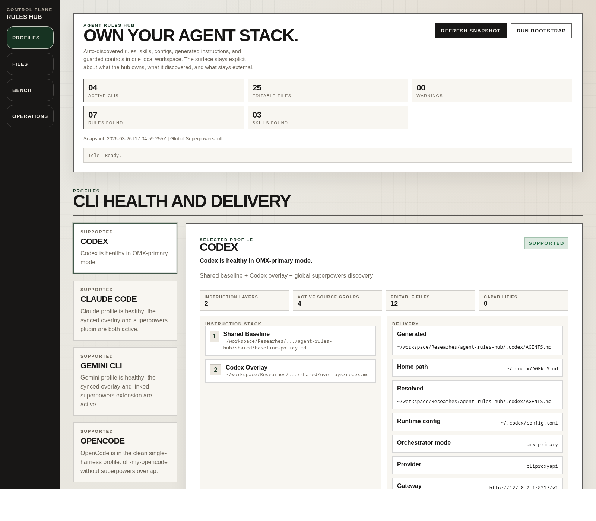
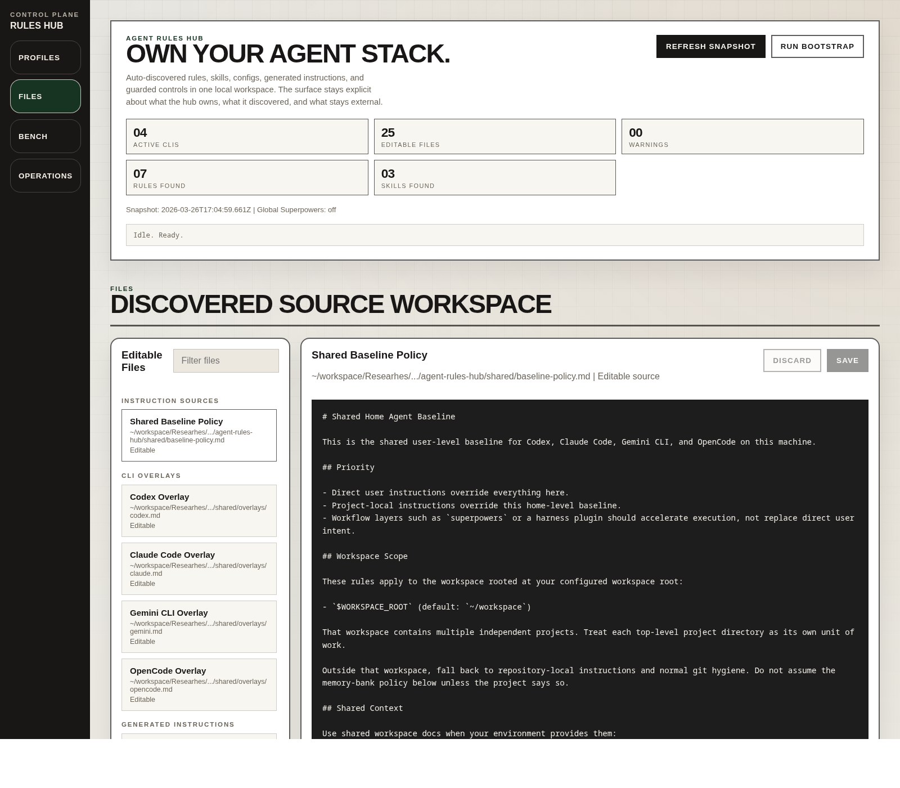
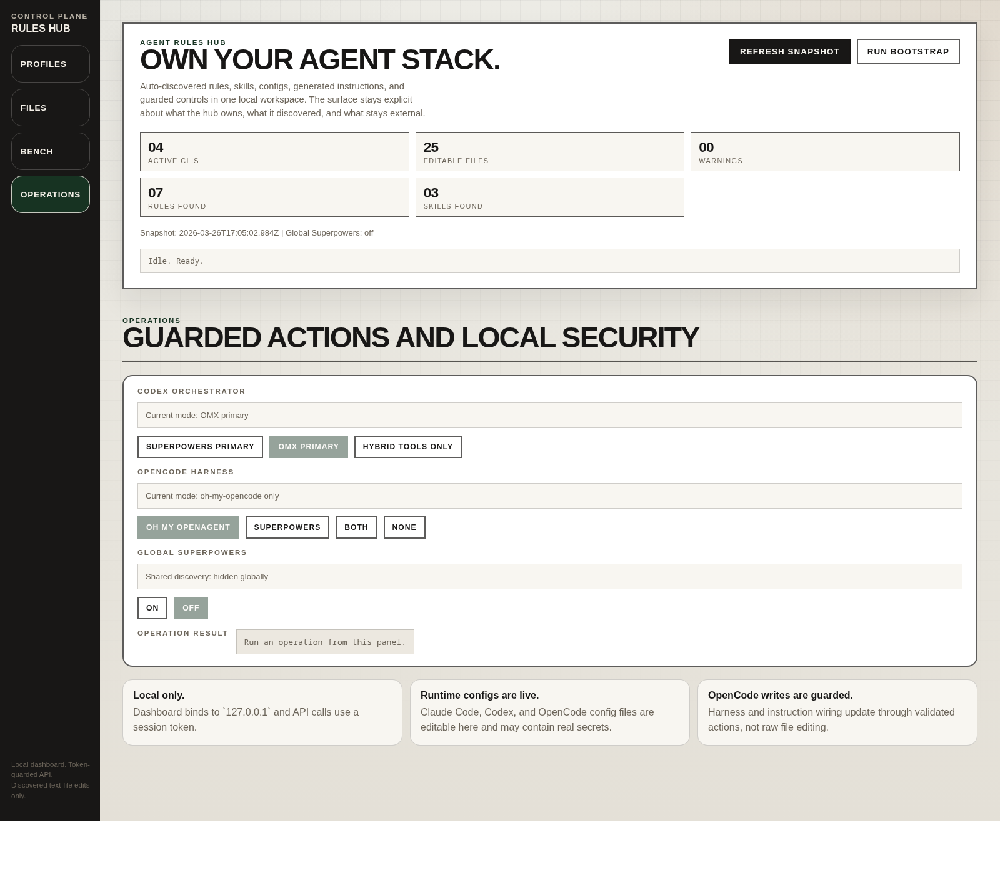

# Agent Rules Hub


> A local-first dashboard for discovering, inspecting, and editing the rule stack behind your AI coding CLIs.

Agent Rules Hub is a **dashboard-first introspection hub** for the 4 CLI stacks this repo supports today: **Codex, Claude Code, Gemini CLI, and OpenCode**.

It does not try to cover every agent ecosystem. It focuses on a narrower, more useful promise:

- detect the supported CLIs from **your own machine**
- show the **actual rule files, skill roots, runtime configs, and generated instruction paths** involved
- let you edit the text-backed surfaces the hub can safely manage
- make the difference between **hub-managed**, **discovered**, and **external** explicit

---

## Why this project is interesting

Most agent tooling helps you **sync** instructions.
Agent Rules Hub helps you **see the live setup**.

That means you can:

- discover common rule and skill files automatically
- inspect what each supported CLI is actually using
- edit text-backed sources from one local dashboard
- keep effective generated outputs visible without pretending they are the source of truth
- manage the setup with an honest status model: **managed**, **detected**, or **broken**

If you use multiple AI coding CLIs, this turns scattered config into one local dashboard workspace.

---

## What the dashboard actually is

This repo is not just a pile of markdown files plus a bootstrap script.
The main product surface is the web dashboard.

When you open it, you get a local workspace with 4 jobs:

1. **Profiles** — understand each supported CLI as a delivery profile
2. **Files** — inspect and edit the discovered text files behind that profile
3. **Bench** — keep reusable capability prompts and evaluation recipes nearby
4. **Operations** — run guarded local actions instead of manually hunting through config folders

The app is still useful even if you have none of the optional extras installed. Plugins, extensions, and helper checkouts deepen the picture, but they are not required to get value from the dashboard.

At the top of the page, the hero area gives you two core actions:

- **Refresh Snapshot** — non-destructively rescan the current machine and rebuild the dashboard state
- **Run Bootstrap** — wire the repo into the home-level paths for the supported CLIs

So the intended flow is not:

> clone repo → read some files → guess what to run

It is:

> clone repo → open dashboard → inspect your current setup → optionally bootstrap from the same UI

---

## Screenshots

### Profiles overview



Use this area to understand the state of each supported CLI: what instruction stack it is using, which sources are active, which capabilities are visible, what constraints exist, and which files the hub can edit.

### Discovered files and editor



This is the working surface for editing discovered text-backed sources. It is intentionally constrained: the hub only exposes files it can identify and classify safely.

### Guarded operations



Operations are for controlled local wiring changes such as switching the Codex orchestrator mode, setting the OpenCode plugin profile, toggling shared skill visibility for Codex/OpenCode, or running bootstrap without leaving the UI.

> These screenshots were captured from a clean local demo environment covering the 4 supported CLIs.

---

## Dashboard walkthrough

### Profiles: the control-room view

**Use this section when:** you want the fastest answer to “what is this CLI really using on this machine?”

The **Profiles** section is the first screen for a reason.
It answers the product question: **“what is this machine actually running?”**

For each supported CLI, the dashboard shows:

- a status summary card
- the preferred delivery profile
- the instruction stack currently in play
- delivery facts and runtime hints
- active rule / skill / plugin / extension sources
- capabilities visible to that CLI
- status details, constraints, and restart hints
- direct links to the editable files related to that profile

This is the area that makes the project feel like a hub instead of a config folder.
It lets users compare Codex, Claude, Gemini, and OpenCode as parallel profiles in one place.

### Files: the editable source workspace

**Use this section when:** you want to inspect the exact text behind a rule stack or edit a hub-managed source/config file.

The **Files** section is where discovery becomes usable.

It groups the files the hub knows how to surface, including:

- shared baseline policy
- per-CLI overlays
- generated instruction outputs
- discovered rule files
- discovered skill files
- benchmark data files
- selected runtime config files

The file list is filterable, and the editor is explicit about whether a file is editable or read-only.

Important behavior:

- editing a **source instruction layer** triggers regeneration of the managed outputs
- generated files remain visible so users can inspect the final delivered text
- runtime config changes can affect live CLI behavior immediately
- the hub does **not** expose arbitrary filesystem editing; it stays inside discovered, allowed text files

### Bench: prompt recipes and capability checks

**Use this section when:** you want to compare setups, demo capabilities, or validate whether a workflow add-on is actually helping.

The **Bench** section keeps reusable prompt recipes close to the dashboard instead of burying them in docs.

Use it to:

- compare how different CLI setups respond to the same task shape
- keep prompt/evaluation recipes discoverable for demos or validation
- make install decisions based on repeatable checks instead of ad-hoc impressions

This matters because the hub is not only about file discovery. It is also about understanding what those rule stacks are *for*.

### Operations: guarded setup, not random shelling out

**Use this section when:** you want to change a supported mode safely without hand-editing runtime paths or config glue.

The **Operations** section is where the dashboard becomes operational rather than read-only.

Today it exposes guarded actions for supported flows such as:

- switching the **Codex orchestrator** mode
- setting the **OpenCode plugin profile**
- toggling the **shared skill discovery path**
- running **bootstrap** from the dashboard itself

The UI also calls out the safety model:

- local-only bind on `127.0.0.1`
- token-guarded API
- guarded writes for sensitive runtime changes
- visibility into actions and their output

That combination matters for an open-source tool: the app is useful, but it is not pretending to be a remote control panel for your machine.

### Hero actions: what users should click first

After starting the app, the intended path is simple:

1. open **Profiles** and inspect the current state
2. click **Refresh Snapshot** if you changed your environment and want a new read
3. open **Files** to inspect or edit discovered sources
4. click **Run Bootstrap** if you want the repo to wire your home-level instruction paths
5. return to **Profiles** to confirm whether a CLI moved from `detected` to `managed`

---

## Status model: how to read the dashboard

The status system is intentionally narrow and honest:

- **`managed`** — the hub is delivering the CLI's instruction path from this repo; optional plugin/extension layers are reported as observed runtime state
- **`detected`** — the CLI is present, but its instruction path is not currently wired to this hub's generated delivery path
- **`broken`** — config parsing failed or another hard problem prevents reliable introspection

That means `detected` is not a shame badge.
It usually means the dashboard successfully found the user's real setup, even if that setup is not fully wired to the repo.

### What to do next by status

| Status | What it means | What to do next |
| --- | --- | --- |
| `managed` | Instruction delivery is wired through this hub. External plugin/extension layers are shown but not owned. | Inspect Profiles or Files, then iterate normally. |
| `detected` | The CLI is found, but its home/config instruction path is not wired to this hub yet. | Use **Run Bootstrap**, then refresh Profiles. |
| `broken` | A parse or introspection failure is blocking trustable state. | Open the affected file from **Files** or follow **Troubleshooting** to fix the config problem first. |

### Terms that matter

- **Active sources** — the rule, skill, plugin, or extension sources the hub can see affecting a profile
- **Editable files** — discovered text files the hub allows you to change from the dashboard
- **Generated outputs** — rendered delivery artifacts produced from the shared baseline plus per-CLI overlays
- **Hub-managed** — the repo controls the file or path directly
- **External** — the hub can see it, but does not own the payload or installation lifecycle

---

## What a new user gets after cloning

If someone else clones this repo and runs the dashboard, they will see **their own environment**, not yours.

The snapshot is built from:

- the cloned repo contents
- the current workspace
- the user's own home paths such as `~/AGENTS.md`, `~/.codex/AGENTS.md`, `~/.claude/CLAUDE.md`, `~/.gemini/GEMINI.md`, and OpenCode config locations
- discovered skill roots such as `~/.agents/skills` and `~/.codex/skills`
- supported runtime config files for the 4 supported CLIs

So the product promise is:

> for the 4 supported CLIs, the hub introspects the user's own local rule stack where it can discover file-backed or config-backed state.

It is **not** a claim that the repo can discover every possible hidden rule or private runtime behavior for every tool.

---

## Why generated outputs exist

Generated files are delivery artifacts, not busywork.

The hub lets you author instructions as:

- one shared baseline
- plus one overlay per supported CLI

But the CLIs themselves typically consume a single effective home-level instruction file.
So the repo renders those source layers into `generated/` outputs and then points the supported CLIs at those outputs when you bootstrap.

That is why the dashboard shows both:

- **source layers** you edit
- **generated outputs** the tools actually consume

Without that split, the app would hide the real delivery surface.

---

## What it does today

### Supported CLIs

| CLI | Discovery | Dashboard editing | Runtime awareness | Guarded actions |
| --- | --- | --- | --- | --- |
| **Codex** | Home rules, repo rules, shared skills, Codex-local skills | Yes | Config summary + orchestrator state | Yes |
| **Claude Code** | Home rules, repo rules, observed plugin state | Yes | Settings summary + plugin state | Indirect |
| **Gemini CLI** | Home rules, repo rules, observed extension state | Yes | Extension summary + source notes | Indirect |
| **OpenCode** | Home instructions, repo rules, config + plugin state | Yes | Config summary + plugin-profile state | Yes |

### Core capabilities

- **Discovery-first introspection**
  - current repo rule files
  - known home-level rule files
  - shared skill roots
  - Codex-local skills
  - Claude plugin state
  - Gemini extension state
  - OpenCode config + plugin state

- **Editable, text-backed sources**
  - shared baseline policy
  - per-CLI overlays
  - runtime config files
  - discovered rule files
  - discovered skill files

- **Generated instruction workflow**
  - baseline + overlay → generated instruction file
  - generated outputs stay visible in the dashboard as delivery artifacts

- **Local safety posture**
  - local-only bind on `127.0.0.1`
  - session-token API guard
  - edit surface restricted to discovered, allowed text files

### Honest scope

This project does **not** claim universal introspection for every agent ecosystem.

It is intentionally focused on the **4 supported CLIs above** and on **common, file-backed setup** that can be discovered and edited locally.

---

## Quick start

### Prerequisites

- Node.js 20+
- at least one of the supported CLIs if you want live per-CLI discovery beyond repo-local files
- optional: `ais` (for helper registration), and whichever CLIs/plugins you personally use

### 1) Clone the repo

```bash
git clone https://github.com/obdagli/agent-rules-hub.git
cd agent-rules-hub
```

### 2) Start the dashboard

```bash
npm run dashboard
```

Then open:

```text
http://127.0.0.1:4848
```

That is the fastest way to explore the dashboard without changing your home setup.

### 3) Use the dashboard first

Recommended first clicks:

- **Profiles** to see the 4 supported CLI profiles
- **Refresh Snapshot** to read the current machine again
- **Files** to inspect discovered sources
- **Run Bootstrap** if you want the hub to wire the home-level instruction paths for you

### 4) Optional: wire it into your home environment

You can bootstrap in either of two ways:

- click **Run Bootstrap** in the dashboard hero
- or run the shell helper directly:

```bash
./scripts/bootstrap-home.sh
```

What bootstrap does:

- regenerates `generated/` outputs locally
- creates direct home-path symlinks for Codex, Claude, Gemini, and OpenCode
- updates the OpenCode config to include the managed instructions path
- optionally registers the repo through `ais` when that tool is installed

Bootstrap intentionally does **not** auto-install or auto-enable external plugins/extensions for Claude, Gemini, or OpenCode.

This is optional for open-source users. The dashboard is still useful before full bootstrap, and missing optional integrations show up as runtime status gaps instead of blocking base discovery.

---

## Why it stands out

Agent Rules Hub is more than a folder of instruction files.

It combines:

- a **web dashboard** for a normally invisible layer of developer tooling
- a **discovery engine** for supported CLI rules, skills, and configs
- a **composition model** for shared baseline + CLI-specific overlays
- a **guarded editing surface** for local, text-backed setup

In one sentence:

> **Own your agent stack without manually hunting through config directories.**

---

## How discovery works

For the supported CLIs, the dashboard currently checks common locations such as:

- current repo rule files
- `~/AGENTS.md`
- `~/.codex/AGENTS.md`
- `~/.claude/CLAUDE.md`
- `~/.gemini/GEMINI.md`
- the OpenCode home instructions path
- `~/.agents/skills`
- `~/.codex/skills`
- optional shared superpowers path when present

The results are surfaced in:

- **Profiles** → active sources, delivery details, constraints, and restart hints
- **Files** → editable or inspectable discovered files
- **Operations** → guarded local actions for supported CLIs

---

## Minimal mental model

```text
shared baseline + per-CLI overlays + runtime configs + discovered skill sources
                              ↓
                    generated instructions + dashboard state
                              ↓
                    one local dashboard workspace for 4 CLIs
```

---

## Repository layout

```text
agent-rules-hub/
├── shared/
│   ├── baseline-policy.md
│   └── overlays/
├── generated/
├── dashboard/
├── lib/
├── scripts/
├── tests/
└── docs/
```

Key areas:

- `shared/` — baseline rules + per-CLI overlays
- `generated/` — rendered delivery artifacts for supported CLIs
- `dashboard/` — local web dashboard
- `lib/` — discovery, state building, composition, config helpers
- `scripts/` — bootstrap and guarded helper actions
- `tests/` — dashboard, discovery, and config coverage

---

## Useful commands

```bash
# Run the dashboard
npm run dashboard

# Regenerate effective instruction files
npm run render:instructions

# Run tests
npm test
```

Additional helper scripts:

| Script | Purpose |
| --- | --- |
| `scripts/bootstrap-home.sh` | Optional home-environment bootstrap |
| `scripts/render-instructions.mjs` | Regenerate managed instruction outputs |
| `scripts/set-codex-orchestrator.sh` | Switch Codex orchestration mode |
| `scripts/set-opencode-plugin.sh` | Set OpenCode plugin profile |
| `scripts/install-dashboard-service.sh` | Install the dashboard as a user service |

---

## Documentation

- [Architecture](docs/ARCHITECTURE.md)
- [Agent Discovery](docs/AGENT_DISCOVERY.md)
- [Capability Matrix](docs/capability-matrix.md)
- [Configuration Examples](docs/CONFIG_EXAMPLES.md)
- [Troubleshooting](docs/TROUBLESHOOTING.md)

---

## Contributing

Contributions are welcome.

Especially valuable contributions:

- stronger precedence modeling for discovered rule stacks
- better workspace/project discovery for the supported CLIs
- better cross-platform service/setup flows
- support for additional CLIs beyond the current 4

See [CONTRIBUTING.md](CONTRIBUTING.md).

---

## License

[MIT](LICENSE)
